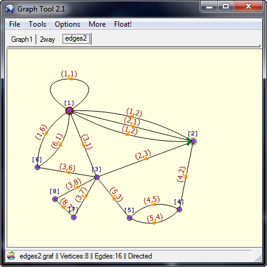
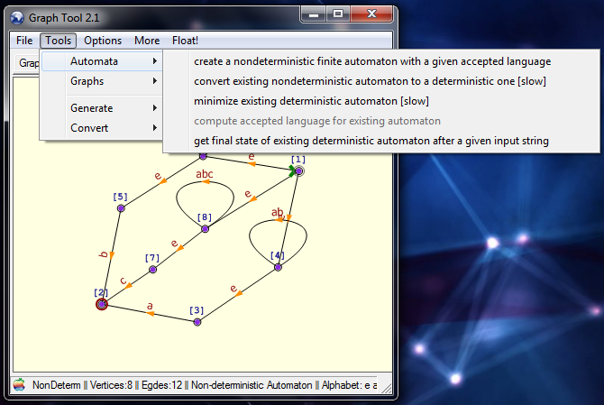
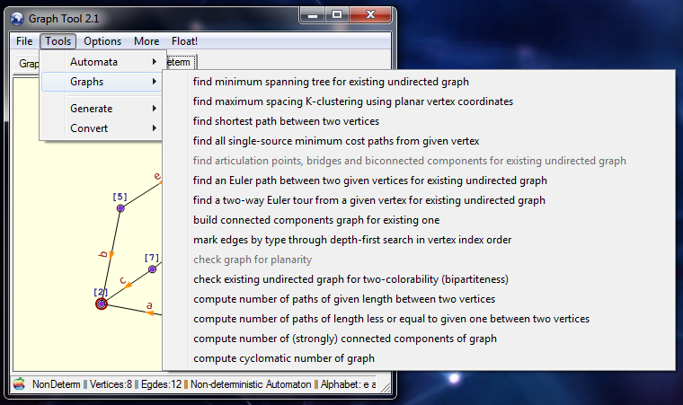

# Graph Tool #

This is a program that demonstrates many algorithms related to graph and automata theory.
  * You can easily create graphs and automata using the simple and effective GUI by placing nodes and edges with your mouse.
  * Watch complex graphs untangle themselves by simulating elastic tension on edges.
  * Generate random directed and nondirected graphs.
  * Generate nondeterministic automaton that accepts a language represented by a given regular expression (examples [here](release/test-regex.txt)).
  * Automatically convert a nondeterministic automaton to an equivalent deterministic one.
  * Minimize a deterministic automaton.
  * Apply numerous graph algorithms including finding connected components, finding shortest paths, K-clustering, Euler paths, checking bipartiteness, computing cyclomatic number, etc.
  * Save screenshots of the displayed graphs or export them as text files.

### Download ###

Download [the binary](release/GraphTool.exe) and check out the sources for [example graphs](release/Tests). Requires [.Net Framework](http://www.microsoft.com/net) version 4.0 or higher.

---
exported from https://code.google.com/archive/p/graphtool/
